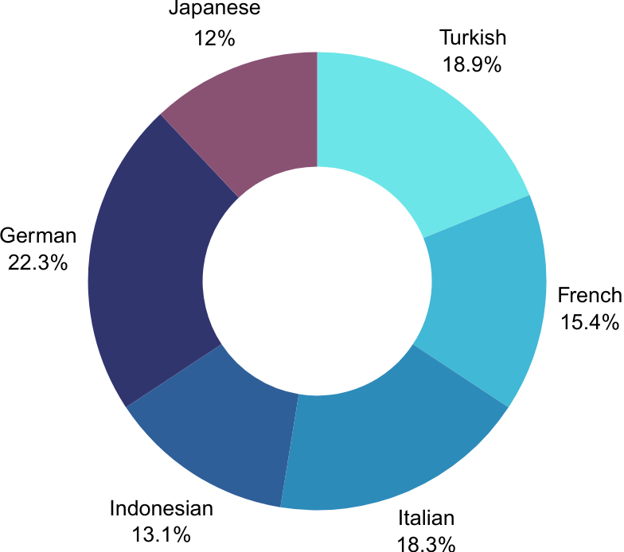

# TED Culture Dataset
This repository contains scripts to build *TED Culture Dataset*. You can download Youtube videos and transcripts, divide the videos into scenes, and extract human poses.

If you have any questions or comments, please feel free to contact me by email ([yixishen1@student.unimelb.edu.au](mailto:yixishen1@student.unimelb.edu.au)).

You can download [the preprocessed TED Culture Dataset](a) (xxx GB) [TO DO]

Except for the method to download the source video and auto-generated subtitles using **TED_video_download.py**, we follow the data collection pipeline of TED Expressive by Liu et al. You can find the details of the TED Expressive dataset [here](https://github.com/alvinliu0/HA2G/blob/main/dataset_script/README.md). Our dataset is multilingual and includes new features, such as 3D upper body keypoint annotations with fine-grained finger details.

## Statistics of TED Culture Dataset

#### Source of the TED-Culture Dataset

| Language   | URL Link                                                     |
| ---------- | ------------------------------------------------------------ |
| Turkish    | https://www.youtube.com/playlist?list=PLsRNoUx8w3rOWHcgwUTIio9PFxFEbIisd |
| French     | https://www.youtube.com/playlist?list=PLsRNoUx8w3rOzmp0qoc53u3vYrcFYsvKj |
| Italian    | https://www.youtube.com/playlist?list=PLsRNoUx8w3rMXlrHn6LWavbsKvnlgc1AN |
| Indonesian | https://www.youtube.com/playlist?list=PLsRNoUx8w3rNkQEmDfmFlkLZQ0LLquMiq |
| German     | https://www.youtube.com/playlist?list=PLsRNoUx8w3rNZlOp1ceqLs76CSEWTSnFi |
| Japanese   | https://www.youtube.com/playlist?list=PLsRNoUx8w3rOHjXIU5EE4KOiIagv9yQaG |

#### Metadata of the TED-Culture Dataset

##### VID of the videos for each language

| Index | Turkish      | French       | Italian       | Indonesian   | German       | Japanese     |
| ----- | ------------ | ------------ | ------------- | ------------ | ------------ | ------------ |
| 1     | x9F1HHO1GDY  | NZI4TZwNZkQ  | \_\_-4faDJDsA | hRVrm3svaUk  | WhAUsnEXVQ4  | gPyVEYP1ajg  |
| 2     | u7\_LASnETn0 | pHyi9IZuyF4  | \_16VKDG7omM  | brwBTcacJtI  | ndbZAEyhmps  | sdBJEhiH\_gM |
| 3     | R2iLnqOUjbU  | pVWyJT1141A  | \_18k5OvRDBo  | cA2KxgPDWNY  | xOTZfGyVh1I  | -V-tqJyxp\_8 |
| 4     | 7kRLxNlGi4I  | 0xKRV\_FadiM | \_1LEZIyshEU  | vNsi243Oa\_g | oy2yKVy7bx0  | wNmeacbSQcE  |
| 5     | TQM-3Q7NIGs  | yx2AagZDEKQ  | \_1rpjC2XLhw  | EsIt6y46BLo  | WIHcCjrjm\_U | Nk8VPNrSkDY  |
| 6     | sUbPneUxkBY  | BGHhs9dP7CI  | \_3IOjpSGFqY  | xuFRrC9jvGY  | aztmYtlE7Yo  | 3djAkIpp7C0  |
| 7     | YGz-GpkRW-4  | G\_Xg4l-6IhE | \_6bxpcmhMAo  | rBldvUhPVSM  | VNZPM1qvce0  | m1MTjrTRvPs  |
| 8     | MeHU\_T1AMLM | Hx2yK1TQF9s  | \_7gn7VH3TKk  | VMAcQ5hIQNE  | QIlI3SnHQw8  | SinvB7r4XFU  |
| 9     | aqAeRJcI9aw  | IyqD7\_g0I2A | \_93sBe97dSs  | ceSJrqjKdvc  | qmKDoAQR5mg  | Cuq5-EhV7Xg  |
| 10    | UoxJinivVUE  | Fxu8vsMi7Ws  | \_BcQods1WSo  | iXvPjMC6D-s  | NUSPZpHLLo8  | nVIIiIw3yDI  |
| 11    | TP2bsvnGRy0  | 0e5jPtkmVBI  | \_DGvk--kbXU  | XyNIDQtXnN8  | BrJaBArQX1M  | FijjNXZAS7A  |
| 12    | 7N6J5ymi8bc  | 9Bnt0wc7hQk  | \_FhVe6j0pYo  | R3zr1gtkxIY  | Le0hfVmCP\_U | NsGhAw6DayU  |
| 13    | FRLfGly\_Xg4 | 8e0jCz7DqJw  | \_fu\_79vHPss | 2FSygABiOWU  | UmNG4B2IYWI  | 16MjBb49fBE  |
| 14    | xdpCVQbuPD8  | DdaDejuhjms  | \_g-CrntQlpI  | PHVVQpMthc4  | VfStQ5GWQm0  | hf8zKw5SBQw  |
| 15    | 7yGYcGRY0Hg  | RPQaldkceYo  | \_GGDTCkM9Uk  | HBpoEMD25Io  | yiVr8AH4mw8  | gWuaSDCTds4  |
| 16    | iydjCDpdj8A  | 9e6P-VByqXo  | \_ih05A0Ypkg  | 7GH\_vDrrm3g | xk6S5edHVas  | bharxOpW\_Pw |
| 17    | IylFgfUlv0E  | SN9zTEWVjGM  | \_IL9gHf14oA  | 0UzBp\_V3PqI | N-dsHgOl00M  | RlrdPth72DQ  |
| 18    | JBX-ibXTnog  | xEP7mjnsidM  | \_IWN808Zzeg  | zYr5qbYEb8Q  | G0F10leavbI  | KvM8OWcUxa0  |
| 19    | d4u\_e-wSGsc | HTHHMtTvO-I  | \_J-5LhHbS6o  | QEdHztQ5VGA  | 3knK7DJefMU  | mlNmmCgUNsE  |
| 20    | 73URcwN8eIo  | -Qwmw18sETk  | \_Jyj4peZpNs  | viTdHncYuPU  | WhcvAXG-lcU  | K0gZ9xCT1A4  |
| 21    | ueH-2zpulxE  | h\_4L-NU3oLM | \_lej1bkGnm8  | yvswvRap1GU  | F8RJNMA9UFs  | R\_4dbjztAGs |
| 22    | 3ywdIMCN5L4  | CZxsNirtGkw  | \_lGGkRIpvHM  | UtuXAbL3WbQ  | xWd\_L8jqozY | bYsgxtuuwjI  |
| 23    | KpeFsUL9ktI  | -i1nYSJj29c  | \_lptfBo94cQ  | 0eH2rcKhQgM  | QCB2p8UYGRc  | Q0g\_Xq84TgY |
| 24    | BMKf0cRv2UY  | 4QiN0bW2vAU  | \_N8JmErA2\_c | KTmMEJUkzvw  | mTok2EyMLvE  | -ny2KWz52J8  |
| 25    | Z\_-HBkxCz9c | o1rERZRFyqE  | \_nQVqT8EBTk  | TmbsG4cbyQI  | D7hB4ZR2Tuo  | sNJIWxDtlSU  |
| 26    | Y1G5zLjj5k4  | tzWi3hZKEV4  | \_P7KIwLw06M  | yvFDFLThheQ  | cBWe4oRYxvY  | TmPMFtWI204  |
| 27    | 158LOMHpzy8  | tV-8q2\_rR5s | \_QdeQN9XxYc  | h56WMLgNRk0  | n1TU9Mc8ymE  | co32zzaJthg  |
| 28    | \_Gbnz826mTo | gT7FBJx3Ezs  | \_RvGJFMK\_sg | x-8dfBJXltc  | ygWqWTEhJps  | CtnKoej1krU  |
| 29    | x8AKbFJQ0N0  | ovobOIFwzrc  | \_RzvxM6H8F4  | GiNvujo5cqE  | DCYLvTja2z0  | xx313NhDyC8  |
| 30    | lbZIVPmhk6k  | zurIUr1PaEo  | \_S5qJo0kJck  | 6Iicwj-VKZg  | f7viFRZAEqM  | tTeAZhGkNIQ  |
| 31    | rNq6wJ05HvE  | \_eFuPz7buIk | \_soZahWpS-0  | EHh0Qcx6Ci8  | fb1DEBJ3DqQ  | O7MNZbyrC2k  |
| 32    | bHKjQz6j\_ac | WUZyYBaGo7E  | \_tmvib5V8Nw  | of\_-dp0s2Wg | KUMJdbw0498  | 8Xp4uBUGdpI  |
| 33    | 4ScDBEQtMeM  | d6lgyQNq-As  | \_uktZkTB58M  | 63ZQ4YjTSKI  | FA-qTVj3o7E  | Tymvs8X50lU  |
| 34    | yUJkF-\_AyMA | \_gvXOuSXj3Y | \_yUP5-m8RcM  | X6gsC7IVYhA  | BQFSAXDk8HI  | -pQAGokDQck  |
| 35    | vXW0jfZqmzo  | kIJSZNaZs2w  | -07DoLCNGgo   | PxfMmpIHt0w  | Q8U87TcxHP0  | 9\_UxBbebzXs |
| 36    | WcNT050FDho  | N\_nLXZaiy0c | -0oCNkjCkVQ   | OCGv3FRDhhE  | EqMYXrzc2xA  | BDHrc2VJTGw  |
| 37    | 70v2x2csyKg  | gpYNxYfl5tc  | -1nD6bZkjlU   | rAMTNz\_JQtI | cgAx08iB9Lo  | ciuciGovixo  |
| 38    | -Gl8zghA0LM  | HgxEeoGzTwE  | -2hdXb\_VgU0  | ZuCyGoAyJ6g  | S65yOVjxZ4Q  | Wh7-rF4E-Eg  |
| 39    | IpWWg-iuNhU  | \_OmbEk0Xgtw | -4ieUEEy9Lo   | dXJmXFhtxKA  | f5a3T5lHBRI  | -gHOwobZ8pM  |
| 40    | c1WLuDc\_igQ | ARrdHEi7HIU  | -63Y5JeIzbk   | jA0IR3bUApo  | g\_foEjGwdmk | JeDn5bJe2nw  |

##### Statistics information of the source videos

| Language   | Seconds | Hours |
| ---------- | ------- | ----- |
| Turkish    | 39915   | 11.1  |
| French     | 36467   | 10.1  |
| Italian    | 32798   | 9.1   |
| Indonesian | 35421   | 9.8   |
| German     | 37649   | 10.5  |
| Japanese   | 34006   | 9.4   |
| Total      | 216259  | 60.1  |

##### Statistics information of the TED-Culture Dataset

| Language   | Number of Speakers | Valid Clip Number | Seconds | Hours | Avg Clip Length in Seconds |
| ---------- | ------------------ | ----------------- | ------- | ----- | -------------------------- |
| Turkish    | 21                 | 306               | 11729   | 3.3   | 38                         |
| French     | 29                 | 457               | 9701    | 2.7   | 21                         |
| Italian    | 35                 | 580               | 11651   | 3.2   | 20                         |
| Indonesian | 29                 | 351               | 8343    | 2.3   | 24                         |
| German     | 39                 | 901               | 14142   | 3.9   | 16                         |
| Japanese   | 30                 | 202               | 7407    | 2.1   | 37                         |
| Total      | 183                | 2797              | 62974   | 17.5  | 23                         |

##### Language Distribution of the TED-Culture Dataset

	

## Acknowledgement

The codebase is developed based on [Learning Hierarchical Cross-Modal Association for Co-Speech Gesture Generation](https://github.com/alvinliu0/HA2G) of Liu et al.
